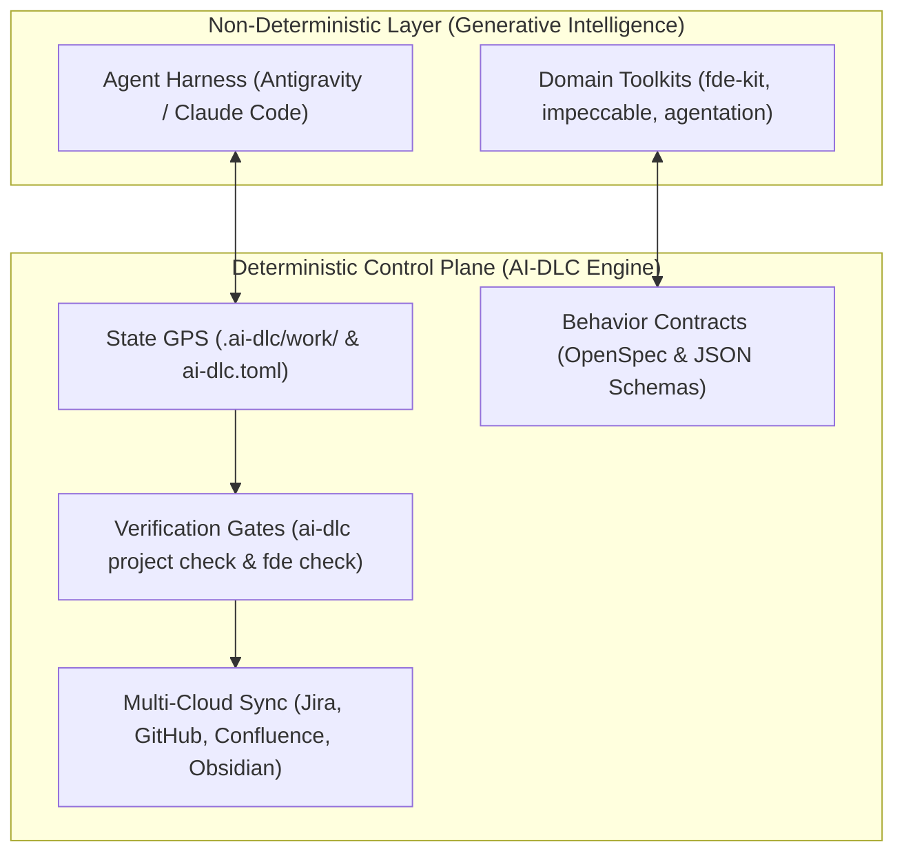
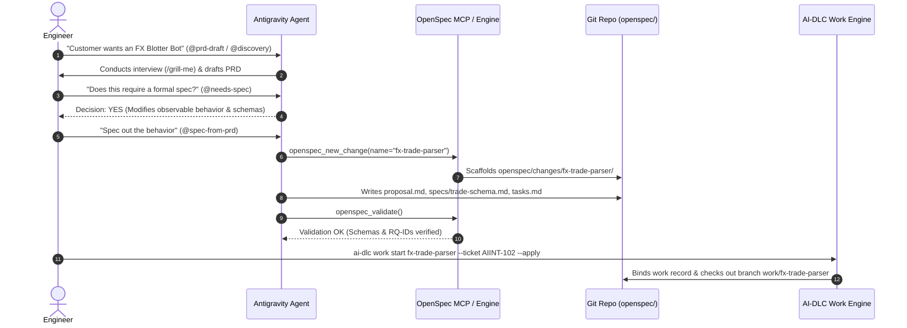
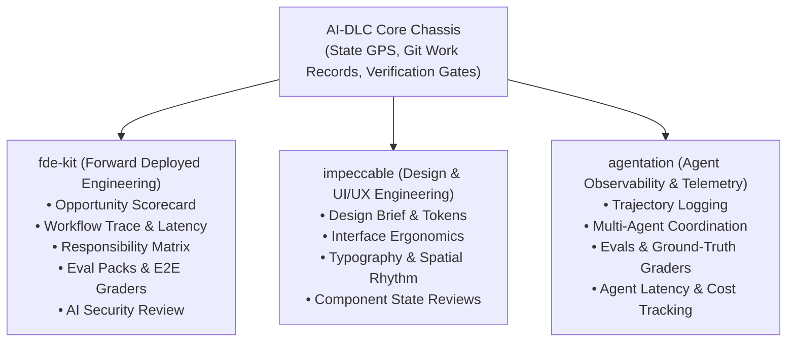
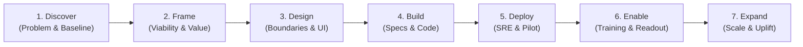

# The AI-DLC & FDE Operating Architecture

> **The Universal Control Plane for Agentic Engineering**
> *How AI-DLC governs agent behavior, orchestrates OpenSpec contracts, syncs multi-cloud state, and powers modular toolkits (`fde-kit`, `impeccable`, `agentation`).*

---

## 1. Why AI-DLC? (The Core Rationale)

LLMs possess vast coding intelligence but **zero inherent discipline**. Left unguided, coding agents default to **"vibes-based development"**:
- They invent non-standard project layouts and hallucinate acceptance criteria.
- They start writing code before requirements, APIs, or data schemas are agreed upon.
- They break existing unit tests and push code without running linters or type checkers.
- They leave tickets out of sync in Jira, let Confluence documentation rot, and accidentally leak credentials or write to unauthorized corporate spaces.

### The AI-DLC Paradigm: Non-Deterministic Intelligence on Deterministic Rails



**AI-DLC is not an agent itself; it is the harness configuration and workflow operating system.**
It wraps probabilistic agentic workflows in **cryptographic integrity hashes**, **strict lifecycle stage gates**, and **multi-system synchronization**—guaranteeing that every line of code is scoped, spec’d, tested, and recorded.

---

## 2. Multi-Cloud Information Flow & Sync Topology

Modern enterprise development spans multiple fragmented systems. AI-DLC establishes **The Triad of Truth**, ensuring each system owns exactly what it is designed for:

```mermaid
flowchart LR
    subgraph CloudTrackers["Business & Issue Tracking"]
        Jira["Jira Cloud (AIINT / AIENG)<br>• Business Epics & Milestones<br>• Status: To Do, In Progress, Done<br>• High-level Owner & Priority"]
    end

    subgraph GitRepo["Git Version Control (Single Source of Truth)"]
        OpenSpec["openspec/<br>• proposal.md<br>• specs/ (BDD/Schemas)<br>• tasks.md"]
        Docs["docs/<br>• charters/<br>• architecture/<br>• 7-stage pages"]
        Code["src/ & tests/<br>• FastMCP servers<br>• BDK handlers<br>• Eval assertions"]
        Work["ai-dlc work/<br>• Active branch<br>• Ticket binding<br>• Evidence hashes"]
    end

    subgraph CloudWiki["Corporate Knowledge & Confluence"]
        Confluence["Confluence Spaces<br>• AI|INT (Engagements & Solutions)<br>• AI|ENG (Tools & Universal Team Intel)<br>• AI|OPS (SRE & Infrastructure)"]
    end

    subgraph LocalObsidian["Engineer Personal Vault (Obsidian)"]
        Vault["obs-brain/<br>• Interview scratchpads<br>• Raw customer thoughts<br>• Personal Playbooks & MOCs"]
    end

    %% Sync Flows
    Jira <== "ai-dlc work start / finish" ==> Work
    Work <== "Cryptographic Evidence Gate" ==> OpenSpec
    GitRepo <== "sync_all.py (XHTML Sync)" ==> Confluence
    GitRepo <.- "link-vault (Local Portals)" -.-> Vault
```

### The Separation of Authority

| Destination | What Lives Here | Authoritative Source For | Sync Mechanism |
| :--- | :--- | :--- | :--- |
| **GitHub Repository** | Code, tests, `openspec/` behavior specs, `docs/` technical designs, `.ai-dlc/work/` records. | **All Technical Truth & System Behavior** | Single Git source of truth. |
| **Jira Cloud** | Epics, client deliverables, status transitions (`To Do` $\rightarrow$ `In Progress` $\rightarrow$ `Done`). | **Project Status, Milestones & Ownership** | AI-DLC CLI (`ai-dlc work start` / `finish`). |
| **Confluence Cloud** | Executive readouts, engagement charters, BDK patterns, SRE runbooks. | **Human Stakeholders & Business Sponsors** | `sync_all.py` / Atlassian MCP to whitelisted spaces (`AIINT`, `AIENG`, `AIOPS`). |
| **Obsidian Vault** | Unfiltered meeting scratchpads, personal developer logs, cross-project MOCs. | **Individual Engineer Cognitive Scratchpad** | Local filesystem portals (`ai-dlc project link-vault`). Never pushed to customer Git. |

---

## 3. Under the Hood: Scoping, PRD Creation & OpenSpec

How does an unstructured customer problem turn into an immutable technical contract? AI-DLC coordinates this via **OpenSpec**:



### The 4 Pillars of an OpenSpec Change

Inside `openspec/changes/<change-name>/`:

1. **`proposal.md` (The "Why" & "Impact")**:
   - Problem statement, measurable business outcome, and user stories.
   - Non-goals (explicitly what is *not* being built).
   - Systems impacted (APIs, databases, downstream consumers).
2. **`specs/<capability>/spec.md` (The "What" — Behavioral Contract)**:
   - Traceable requirement IDs (`RQ-001`, `RQ-002`).
   - Gherkin BDD scenarios (`Given [precondition] When [action] Then [observable outcome]`).
   - Concrete JSON schemas for tool inputs/outputs, error payload contracts, and state machines.
3. **`tasks.md` (The "How" — Checklist of Truth)**:
   - Atomic, sequential implementation tasks.
   - Test fixture creation, eval set builds, and security review tasks.
   - Required completion checkboxes: `ai-dlc project check` blocks merging if any task remains unchecked `[ ]`.
4. **Promotion & Archival (`openspec archive`)**:
   - When `ai-dlc work finish` runs, OpenSpec delta specs are **promoted** into permanent capability specs under `openspec/specs/`, and the change is archived to `openspec/changes/archive/YYYY-MM-DD-<name>/`.

---

## 4. Extensibility: Modular Domain Kits

AI-DLC provides the core foundation. Specialized engineering toolkits plug into the harness through **Progressive Disclosure Skills** (`.agents/skills/`), **Rules** (`.agents/rules/`), and **MCP Servers** (`.agents/mcp_config.json`):



### How Extensible Kits Mount into Your Workflow:
- **`fde-kit`**: Mounts into `.agents/skills/fde-*`. Equips the agent with financial engineering patterns, model extraction vs deterministic validation splits, and customer pilot readouts.
- **`impeccable`**: Mounts into design workflows (`@design-brief`, `@design-evaluate`). Enforces design system compliance, component states, and accessibility standards for frontend/BDK apps.
- **`agentation`**: Hooks into the runtime engine to benchmark agent accuracy, measure tool-calling latency, and capture golden trajectories.

---

## 5. The 7 Engagement Stages: Definitions & Life Cycle

Here is the exact anatomy of every stage in the FDE lifecycle, how tools connect, and what artifacts are produced:



---

### Stage 1: Discover (Problem & Workflow Baseline)
- **Goal:** Uncover the real customer friction without assuming AI is the solution.
- **Active Tools & Skills:** `/grill-me`, `@fde-workflow-trace`, `@discovery`.
- **Inputs & Upstream Sync:** Client kickoff meeting notes from Obsidian, Jira Epic description.
- **Git Artifacts Produced:** `docs/engagements/<slug>/01-discover.md`, `toolkit/workflow-trace.md` (logs manual step touchpoints, error rates, and operator latency).
- **Exit Gate:** Quantified baseline metric established (e.g., *"Manual confirmation takes 15 minutes with 4% booking error rate"*).

---

### Stage 2: Frame (Viability, Scorecard & Economics)
- **Goal:** Determine if the initiative is technically viable, economically sound, and high-impact.
- **Active Tools & Skills:** `@fde-opportunity-scorecard`, `@prd-draft`.
- **Inputs:** Workflow trace findings from Stage 1.
- **Git Artifacts Produced:** `docs/engagements/<slug>/02-frame.md`, `charter.md` (Executive problem statement, business sponsor, measurable pilot success criteria).
- **Exit Gate:** Scorecard passes minimum viability threshold; customer sponsor signs off on the Charter.

---

### Stage 3: Design (System Patterns, Responsibilities & Ergonomics)
- **Goal:** Establish immutable boundaries between generative models, deterministic code, and humans.
- **Active Tools & Skills:** `@fde-responsibility-matrix`, `impeccable` (`@design-brief`, `@design-evaluate`), `docs/design/`.
- **Inputs:** Approved Charter and System Patterns guide (`learning/system-patterns.md`).
- **Git Artifacts Produced:**
  - `docs/engagements/<slug>/03-design.md`.
  - Responsibility Matrix (Model extraction vs Deterministic limit check vs Human trader sign-off).
  - UI/UX layout and BDK interactive card designs.
- **Exit Gate:** System pattern explicitly categorized (`Assist` vs `Extract, Validate, Act`); zero unreviewed autonomous writes allowed for consequential actions.

---

### Stage 4: Build (Formal Spec, Implementation & Quality)
- **Goal:** Deliver tested, production-grade code adhering to exact behavioral contracts.
- **Active Tools & Skills:** `ai-dlc work start`, `openspec_*` MCP tools, `@fde-eval-pack`, `@fde-security-review`.
- **Inputs:** Design docs and Jira task tickets (`AIINT-xxx`).
- **Git Artifacts Produced:**
  - Branch: `work/<feature-slug>`.
  - Behavioral contract: `openspec/changes/<feature-slug>/` (`proposal.md`, `specs/`, `tasks.md`).
  - Production code: `src/` (FastMCP servers, BDK event listeners).
  - Test suites: `tests/evals/` (Golden dataset fixtures and assertion graders).
- **Exit Gate:** `ai-dlc fde check <slug>` and `ai-dlc project check --required` pass with 100% green exit code 0.

---

### Stage 5: Deploy (Environment Packaging, SRE & Pilot Release)
- **Goal:** Safe, observable deployment to staging or client pilot sandbox.
- **Active Tools & Skills:** `AIOPS` runbooks, `agentation` observability hooks, Docker/GKE configs.
- **Inputs:** Verified code from Stage 4.
- **Git Artifacts Produced:** `docs/engagements/<slug>/05-deploy.md`, Helm charts, MCP server configuration manifests.
- **Exit Gate:** Health check endpoints return 200; telemetry dashboards streaming logs; secrets managed via environment variables.

---

### Stage 6: Enable (Pilot Readouts, Training & Stakeholder Handoff)
- **Goal:** Prove measurable pilot ROI and train client users.
- **Active Tools & Skills:** `ai-dlc work finish`, `sync_all.py` (Confluence sync), `@handoff`.
- **Inputs:** Pilot performance logs vs Stage 1 baseline metrics.
- **Git Artifacts Produced:**
  - `docs/engagements/<slug>/06-enable.md`.
  - Executive Pilot Readout memo.
- **Exit Gate:** Jira ticket auto-closed with verification digest; Pilot Readout published to Confluence space `AIINT` (`fde_engagements/`).

---

### Stage 7: Expand (Scale, Universal Intel & Feedback Loop)
- **Goal:** Harden the pilot into universal company intelligence so future projects build faster.
- **Active Tools & Skills:** `/learn`, `ai-docs` sync to `AIENG`.
- **Inputs:** Retrospective lessons and client expansion opportunities.
- **Git Artifacts Produced:**
  - Reusable BDK/ADK connectors published to `AIENG`.
  - Permanent system lessons stored in repo rules (`.agents/rules/`).
- **Exit Gate:** `docs/engagements/<slug>/07-expand.md` signed off; reusable components packaged into the internal library.

---

## 6. State Awareness: How to Know Project State & What to Do Next

You never have to guess where a project stands. Use **The 3 Diagnostic Indicators**:

### 1. The Terminal GPS (`ai-dlc next`)
Run this anywhere in your repository:
```bash
ai-dlc next
```
**What it outputs:**
```text
Active work: fx-trade-parser
Bound branch: work/fx-trade-parser
Jira ticket: AIINT-102 (In Progress)
OpenSpec change: fx-trade-parser (3 of 4 tasks checked)
Missing evidence: test-eval-suite
Next command: ai-dlc project check --required
```

### 2. The Engagement Health Gate (`ai-dlc fde check`)
Run this to verify stage prerequisites:
```bash
ai-dlc fde check bnp-fx-blotter
```
*Validates that stage landing pages are populated, stakeholder owners are defined, and system patterns are locked.*

### 3. Natural Language Orientation in Antigravity Chat
Simply prompt the agent:
> *"What is the current state of our project, and what is our exact next action?"*

The agent reads `.ai-dlc/work/`, checks Git status, inspects the active OpenSpec tasks, and replies with the precise command to advance the project needle.
