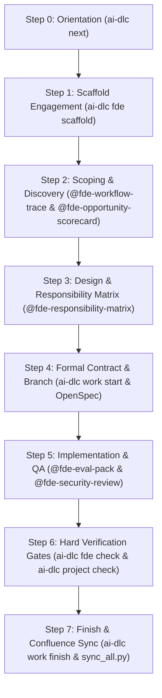

# Human Operating Flow: FDE & AI-DLC Playbook

This runbook outlines the exact **human-in-the-loop operating flow** for an engineer working with Antigravity and AI-DLC. It shows how an engineer explicitly advances an engagement from raw idea to verified production while being pulled along rails and consistency checks.

---

## 1. The Interaction Model: Commands, Skills, and Rails

Engineers operate across three complementary control mechanisms:

| Mechanism | Examples | Where It Runs | Purpose |
| :--- | :--- | :--- | :--- |
| **Deterministic CLI Rails** | `ai-dlc next`<br>`ai-dlc fde scaffold`<br>`ai-dlc work start`<br>`ai-dlc fde check`<br>`ai-dlc project check`<br>`ai-dlc work finish` | Terminal | Explicit state transitions, branch creation, dependency locking, and hard verification gates. |
| **FDE Domain Skills** | `@fde-workflow-trace`<br>`@fde-opportunity-scorecard`<br>`@fde-responsibility-matrix`<br>`@fde-eval-pack`<br>`@fde-security-review` | Chat UI (Type `/` or `@` in Antigravity, `/skill` in Claude Code) | Guided methodology templates for discovery, architecture boundaries, eval suites, and security reviews. |
| **Harness Commands** | `/grill-me`<br>`/learn` | Antigravity Chat UI | Native harness modes for adversarial design interviewing and persisting session lessons. |

---

## 2. The 7-Stage End-to-End Human Flow



---

### Step 0: Orientation ("Where am I?")

Whenever you sit down to work on a repo, you never have to guess what needs doing.

```sh
ai-dlc next
```
*Outputs the active work record, unmerged deliverable branch, missing verification evidence, and the exact command required to proceed.*

In Antigravity chat, you can also ask:
> *"What should we do next on this engagement?"*
The agent reads `.ai-dlc/work/` and summarizes current state.

---

### Step 1: Scaffold the Engagement Structure

When starting a new client engagement, run the local scaffolder:

```sh
ai-dlc fde scaffold bnp-fx-blotter --title "BNP Paribas - FX Trade Blotter Assistant"
```

**What this creates automatically:**
- `docs/engagements/bnp-fx-blotter/charter.md` (Stakeholders, measurable business problem, timeline).
- Landing pages for all 7 lifecycle stages:
  - `01-discover.md`
  - `02-frame.md`
  - `03-design.md`
  - `04-build.md`
  - `05-deploy.md`
  - `06-enable.md`
  - `07-expand.md`

---

### Step 2: Scoping (Discovery & Frame)

Use the Antigravity chat to interview stakeholders and measure the manual workflow:

1. **Adversarial Interview (Harness Command)**:
   > Type: `/grill-me`
   > *"We want an institutional FX chat assistant for BNP Paribas traders that extracts trade confirmations and suggests booking them into Calypso. Interrogate my assumptions and identify missing constraints."*

2. **Map the Baseline Workflow (FDE Skill)**:
   > Type: `@fde-workflow-trace`
   > *"Map the customer's current manual trade confirmation workflow and log touchpoints."*
   $\rightarrow$ Produces `toolkit/workflow-trace.md` measuring latency, human handoffs, and error rates.

3. **Score Viability (FDE Skill)**:
   > Type: `@fde-opportunity-scorecard`
   > *"Score whether this workflow is viable for an LLM vs deterministic code."*
   $\rightarrow$ Scores error tolerance, data availability, and latency requirements.

---

### Step 3: Design & System Boundaries

Before writing any code, define the system pattern and boundaries:

1. **System Pattern Selection**:
   Decide which pattern fits ([`learning/system-patterns.md`](../../learning/system-patterns.md)):
   - *Assist*: Model suggests, human clicks to book.
   - *Extract, Validate, Act*: Model extracts fields, code checks limits against ERP, analyst approves.

2. **Responsibility Matrix (FDE Skill)**:
   > Type: `@fde-responsibility-matrix`
   > *"Separate responsibilities across Model, Deterministic Code, and Human Trader."*
   $\rightarrow$ Populates the responsibility matrix in `charter.md`.

---

### Step 4: Formal Contract & Work Record

Now lock the deliverable branch and behavioral contract:

```sh
ai-dlc work start fx-trade-parser --ticket AIINT-102 --apply
```
**What happens:**
- Checks out branch `work/fx-trade-parser`.
- Creates `.ai-dlc/work/fx-trade-parser.toml` bound to Jira ticket `AIINT-102`.
- Enforces OpenSpec: The agent generates `openspec/changes/fx-trade-parser/` with `proposal.md`, JSON schemas in `specs/`, and task checklist in `tasks.md`.

---

### Step 5: Implementation, QA & Security

Write code on the deliverable branch with AI assistance:

1. **Implement Code & Adapters**: FastMCP server, Python BDK handlers, data validation models.
2. **Build Eval & Assertion Suite (FDE Skill)**:
   > Type: `@fde-eval-pack`
   > *"Generate 10 synthetic trade confirmations with edge cases (broken currencies, missing notionals) and build assertion tests."*
   $\rightarrow$ Generates `tests/evals/` benchmark suite.
3. **Security & Governance Audit (FDE Skill)**:
   > Type: `@fde-security-review`
   > *"Audit our parser for prompt injection risks, PII redaction, and audit logging."*

---

### Step 6: Hard Verification Gates (Pre-Merge Rail)

Before merging or marking any work complete, you must pass two deterministic gates:

1. **Stage Prerequisite Check**:
   ```sh
   ai-dlc fde check bnp-fx-blotter
   ```
   *Validates that stage documentation, ownership matrix, and problem frames are complete.*

2. **Evidence Gate**:
   ```sh
   ai-dlc project check --required
   ```
   *Runs formatting, linting, typechecking, tests, and documentation link validation.*

---

### Step 7: Finish & Confluence Knowledge Sync

1. **Complete Work Record & Transition Jira**:
   ```sh
   ai-dlc work finish fx-trade-parser
   ```
   *Closes the work record, verifies the commit chain, merges the deliverable branch, and automatically transitions Jira `AIINT-102` to `Done` with verification hashes.*

2. **Sync to Confluence**:
   - Engagement solutions and pilot readouts publish to **`AI|INT`** under `fde_engagements/`.
   - Reusable engineering tools and universal team rules publish to **`AI|ENG`**.
   ```sh
   python3 ../ai-docs/scripts/sync_all.py
   ```
   *Converts Markdown to native Confluence XHTML, updates `confluence/page_map.json`, and attaches under the approved parent page.*
