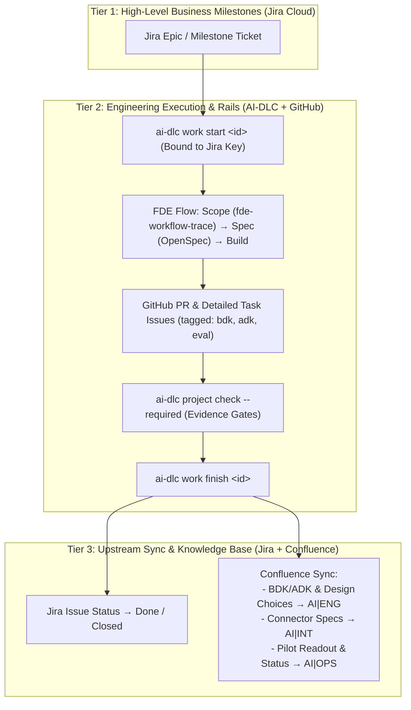

# Team Onboarding & Multi-Tier Workflow Setup Guide

This runbook guides AI Enablement Forward Deployed Engineers (FDEs) through machine provisioning, credential setup, agent harness configuration, and engagement execution.

---

## 1. Fast, Low-Friction Machine Setup

We minimize onboarding friction by providing a single setup script that handles platform quirks, installs runtimes, and registers your machine profile.

### Supported Platforms
- **macOS (Apple Silicon & Intel)**: Native via Homebrew and mise.
- **Ubuntu / Debian Linux**: Native via `apt` and mise.
- **Windows**: Supported exclusively through **WSL2 (Ubuntu)**.
  > [!IMPORTANT]
  > AI-DLC requires a POSIX environment. On Windows, open PowerShell as Administrator, run `wsl --install -d Ubuntu`, restart your computer, and run all commands inside your Ubuntu WSL2 terminal.

### Step 1: One-Command Enrollment
From your terminal, clone `fde-kit` and run the setup script:

```sh
git clone git@github.com:Symphony-Professional-Services/fde-kit.git
cd fde-kit
./scripts/setup-fde.sh
```

### Step 2: Provision Toolchains
Run the AI-DLC provisioner to install runtimes (Python 3.12, Node 22, `uv`, `claude-code`, and `openspec`):

```sh
ai-dlc setup apply
```

---

## 2. Low-Friction Authentication (API Keys vs OAuth)

While OAuth 2.0 (3LO) is supported, setting up custom OAuth applications across enterprise Jira/Confluence instances requires admin approval and complex client redirects. **To minimize friction, we use scoped personal API tokens passed via process environment variables.**

Add the following to your shell configuration (`~/.zshrc` on Mac, `~/.bashrc` on Linux/WSL2):

```sh
# --- Symphony AI Enablement Tooling Credentials ---

# 1. Atlassian (Jira & Confluence)
# Generate from: https://id.atlassian.com/manage-profile/security/api-tokens
export ATLASSIAN_EMAIL="your.name@symphony.com"
export ATLASSIAN_API_TOKEN="<your-atlassian-api-token>"

# Alias for AI-DLC Jira provider
export JIRA_EMAIL="$ATLASSIAN_EMAIL"
export JIRA_API_TOKEN="$ATLASSIAN_API_TOKEN"

# 2. GitHub
# Verify your CLI is authenticated (creates personal auth token in keychain)
# Run once in terminal: gh auth login
```

Reload your shell:
```sh
source ~/.zshrc   # or source ~/.bashrc
```

---

## 3. Confluence Knowledge Base & Space Guardrails

To allow agent harnesses (Antigravity and Claude Code) to retrieve institutional knowledge (Symphony BDK, ADK, rules, design choices) without accidentally writing to unauthorized company spaces, access is strictly scoped to three approved spaces:

| Space Key | Space Name | Purpose |
| :--- | :--- | :--- |
| `AIENG` (`AI\|ENG`) | **AI Engineering & Tools** | Engineering tools, developer infrastructure, universal intelligence for the team (setting up and using `ai-dlc`, `fde-kit`, managing `ai-docs`), overall AI-DLC engineering practices, developer rules, and platform toolchains. |
| `AIINT` (`AI\|INT`) | **AI Intelligence & Solutions** | Implementations, customer solutions, product development, MCP servers, and agent development stored under **engagements** (`fde_engagements/` e.g. `c9_migration`, `visual_analytics`), partner solutions, and pilot readouts. |
| `AIOPS` (`AI\|OPS`) | **AI Operations & SRE** | Operational execution, SRE bot deployments, cluster infrastructure, MLOps, telemetry, secrets, and fleet management. |

### Defense-in-Depth Guardrails

To guarantee agents cannot write outside these spaces, we enforce three layers of protection:

1. **MCP Server Whitelisting**:
   In your project `.agents/mcp_config.json` (or global Antigravity config), configure the Atlassian MCP server with an explicit space whitelist:
   ```json
   {
     "mcpServers": {
       "confluence": {
         "command": "npx",
         "args": ["-y", "@modelcontextprotocol/server-confluence"],
         "env": {
           "CONFLUENCE_BASE_URL": "https://symphony.atlassian.net/wiki",
           "CONFLUENCE_EMAIL": "${ATLASSIAN_EMAIL}",
           "CONFLUENCE_API_TOKEN": "${ATLASSIAN_API_TOKEN}",
           "ALLOWED_SPACES": "AIINT,AIENG,AIOPS"
         }
       }
     }
   }
   ```
2. **Server-Side Atlassian Permissions**:
   The Atlassian user/service account should have View access company-wide if needed, but **Edit/Create permissions restricted exclusively to `AI|INT`, `AI|ENG`, and `AI|OPS`**. Any rogue write call is blocked with HTTP 403 Forbidden.
3. **Agent Prompt Rails (`AGENTS.md`)**:
   Rules instruct the agent:
   > *"Documentation updates must target only `AI|INT`, `AI|ENG`, or `AI|OPS`. Writing or modifying pages in any other Confluence space is strictly prohibited."*

---

## 4. Multi-Tier Engagement Workflow

We connect high-level customer tracking with lower-level technical execution across Jira, GitHub, AI-DLC, and Confluence:



### Lifecycle Walkthrough

#### Stage 1: High-Level Ticket in Jira
Project managers and customer leads define an engagement milestone in Jira:
- **Jira Issue**: `AIENG-104: Client X - Trade Extraction Assistant Pilot`

#### Stage 2: Initialize & Bind in AI-DLC
Inside the client engagement repository, initialize the work record bound to Jira:

```sh
ai-dlc work start trade-extraction --ticket AIENG-104 --apply
```
This checks out a deliverable branch and links all local artifacts to the Jira issue.

#### Stage 3: Scope & Specify (Agent Guided)
Ask Antigravity or Claude Code to guide you through the FDE methods:
1. **Map Current Flow**: *"Run `fde-workflow-trace` to map the customer's trade entry steps."*
2. **Score Viability**: *"Run `fde-opportunity-scorecard` to assess whether this pattern is suitable."*
3. **Draft Requirements**: *"Draft the PRD for this pilot engagement."*
4. **Behavior Specification**: Create an OpenSpec change (`openspec/changes/trade-extractor/`) to freeze the tool-calling and data schema contracts.

#### Stage 4: Build & Verify
- Implement code and tests.
- Tag low-level GitHub issues for tracking individual components (`bdk`, `adk`, `eval`).
- Run `fde-eval-pack` to build assertion suites and error analysis.
- Run `fde-security-review` to verify data handling and prompt injection safeguards.
- Validate with the evidence gate:
  ```sh
  ai-dlc project check --required
  ```

#### Stage 5: Sync with Jira and Confluence
When tests pass and verification evidence is collected:

```sh
ai-dlc work finish trade-extraction
```

1. **Jira**: AI-DLC transitions `AIENG-104` to `Done` with a comment summarizing the verification digest and commit SHA.
2. **Confluence Sync**:
   - Engagement solutions, MCP development, customer pilot readouts, and agent implementations publish to **`AI|INT`** under `fde_engagements/`.
   - Universal engineering tools, AI-DLC/FDE-Kit guidance, `ai-docs` practices, and shared developer rules publish to **`AI|ENG`**.
   - Deployment runbooks, SRE bot operations, and infrastructure monitoring publish to **`AI|OPS`**.
